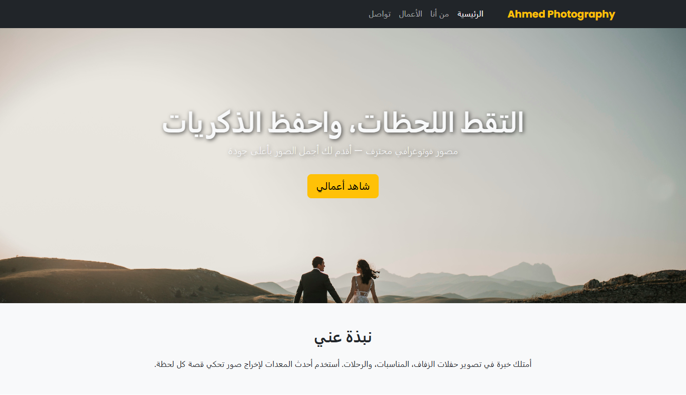

# 📸 Ahmed Photography Portfolio

[]()
[]()
[]()
[]()
[]()
[]()

---

موقع برتفوليو احترافي لمصور فوتوغرافي، يعرض فيه أعماله وصوره بشكل منظم وجذاب، مع تعريف شخصي به، وطريقة للتواصل.  
الموقع مصمم باستخدام **Bootstrap 5** لضمان الاستجابة الكاملة على جميع الأجهزة، مع لمسات جمالية مخصصة بـ CSS.

---

## 🎯 المميزات

- 🌟 تصميم أنيق وجذاب مع ألوان احترافية.
- 📱 متجاوب بالكامل مع جميع أحجام الشاشات.
- 🖼️ معرض صور (Gallery) مع تأثير تكبير وعرض بالـ Lightbox.
- 📝 صفحة "من أنا" لعرض نبذة عن المصور وخبراته.
- 📬 صفحة تواصل (Contact) بفورم أنيق.
- ⚡ كود نظيف ومنظم لسهولة التعديل.

---

## 🗂️ هيكل الصفحات

- **index.html** → الصفحة الرئيسية + Hero Section.
- **about.html** → صفحة التعريف بالمصور.
- **gallery.html** → معرض الأعمال.
- **contact.html** → صفحة التواصل.

---

## 🛠️ التقنيات المستخدمة

- **HTML5**
- **CSS3 + Bootstrap 5**
- **JavaScript (Lightbox Plugin)**
- **Google Fonts**
- **Lightbox2** لعرض الصور بالحجم الكامل.

---

## 📷 لقطات من الموقع

> _(ضع هنا صور Screenshots للموقع بعد التشغيل)_  
>  > 

---

## 🚀 طريقة التشغيل محليًا

1. انسخ المشروع:
   ```bash
   git clone https://github.com/USERNAME/photographer-portfolio.git
   ```
